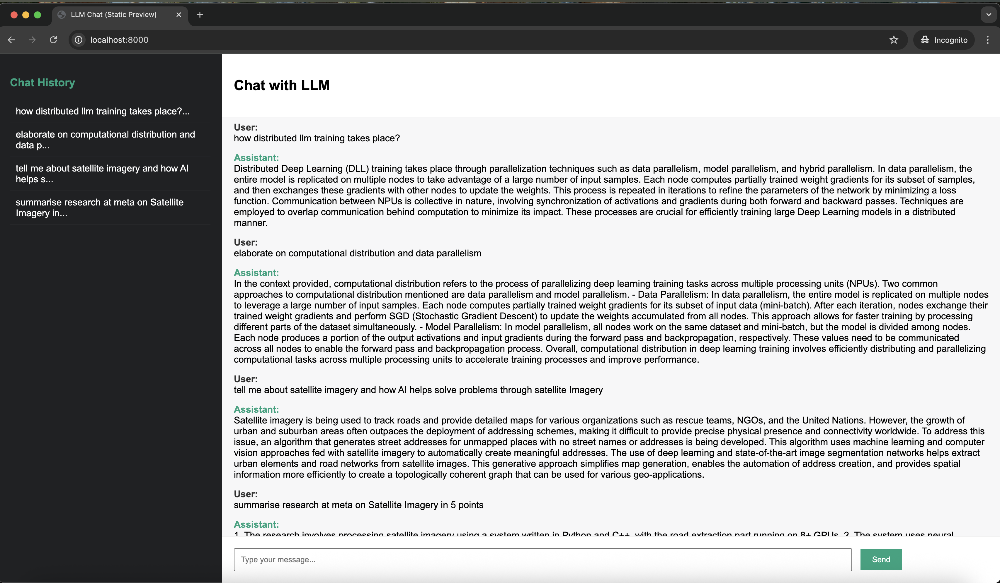

# 🚀 Multi-Agent Graph RAG
A modular, multi-agent Retrieval-Augmented Generation (RAG) system using graph-based orchestration, powered by Flask, LangGraph, LangChain, ChromaDB, and OpenAI APIs.

## 📊 System Architecture
### 🧠 Graph Workflow
The multi-agent system leverages a LangGraph flow for orchestrating document retrieval, agent collaboration, and final response generation.

### Graph

## 🌐 Flask Web Application
The front-end Flask app provides an interactive interface to query documents using the RAG system.

### Flask App

## ⚙️ Tech Stack
🐳 Docker – Containerization for easy deployment

🌐 Flask – Lightweight web framework for UI and API

🧠 OpenAI API – LLM-powered agents for query understanding and response generation

🧬 ChromaDB – Vector database for fast document search and retrieval

🔁 LangGraph – Graph-based orchestration of multi-agent logic

🔗 LangChain – Integration layer for LLM workflows and tools

### Clone the repo
git clone https://github.com/your-username/multi-agent-graph-rag.git
cd multi-agent-graph-rag

### Build and run with Docker
docker build -t graph-rag-app .
docker run -p 8000:8000 graph-rag-app

