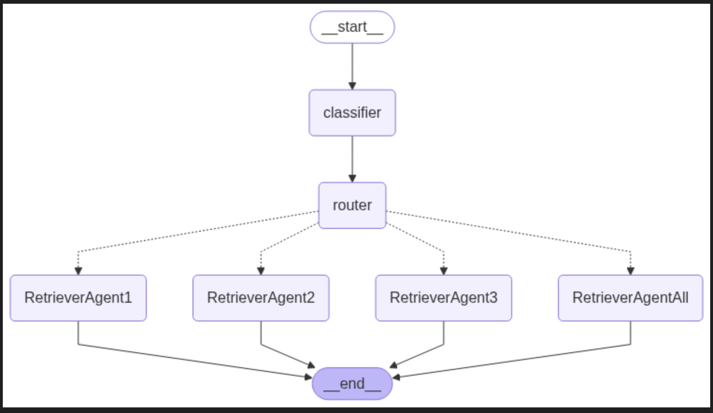
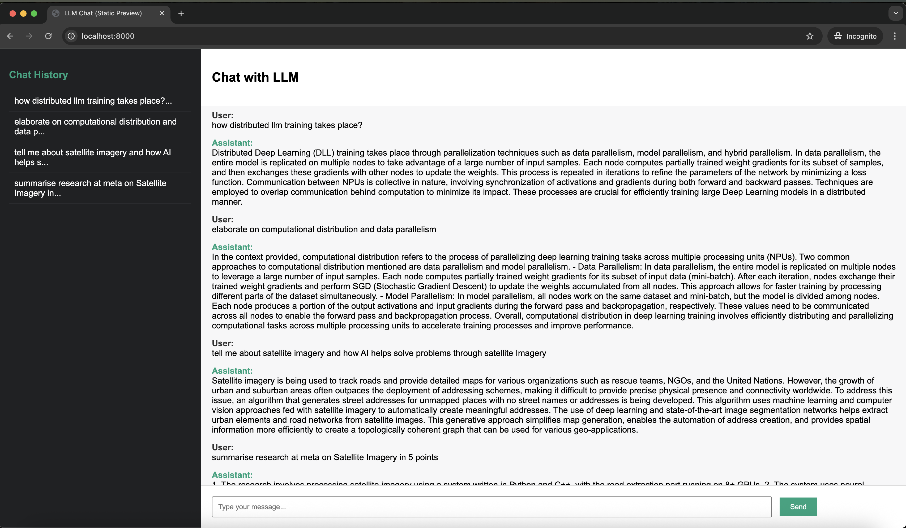

# 🚀 Multi-Agent Graph Orchestration of RAG
A modular, multi-agent Retrieval-Augmented Generation (RAG) system using graph-based orchestration, powered by Flask, LangGraph, LangChain, ChromaDB, and OpenAI APIs.

#### Note 
-- This is a framework that takes user input for multiple segment which carries files for different departments/function. Below is an example of folder structure:  

data/ \
├── Segment1/ \
│ ├── file1.pdf \
│ └── file2.pdf \
├── Segment2/ \
│ ├── file3.pdf \
│ ├── file4.pdf \
│ └── file5.pdf \
└── Segment3/ \
├── file6.pdf \
├── file7.pdf \
├── file8.pdf \
└── file9.pdf 

## Application
    Fast Retrieval Augmented Generation for LARGE ENTERPRISE with petabytes of data and multiple Segments of functions/business 
    Optimized Rtrieval of Content using Heirarchial Knowledge Graph and Segmentation 

## 📊 System Architecture
### 🧠 Graph Workflow
The multi-agent system leverages a LangGraph flow for orchestrating document retrieval, agent collaboration, and final response generation.

### Graph

## 🌐 Flask Web Application
The front-end Flask app provides an interactive interface to query documents using the RAG system.

### Flask App

## ⚙️ Tech Stack
🐳 Docker – Containerization for easy deployment

🌐 Flask – Lightweight web framework for UI and API

🧠 OpenAI API – LLM-powered agents for query understanding and response generation

🧬 ChromaDB – Vector database for fast document search and retrieval

🔁 LangGraph – Graph-based orchestration of multi-agent logic

🔗 LangChain – Integration layer for LLM workflows and tools

## Order of Execution 
1. embed_files.py -  Creates Embedding Vectors and Stores in ChromaDB with HNSW Graph Based storage and retrieval 
2. docker-compose - "docker compose up --build" :- It compose/creates docker container with all the dependendencies and host the Flask App 

## Higlights
-- The Langgraph Graph Builders does following steps: 
    -- *Classify Query* - It classifies query into the folder structure 
    -- *Router* - Routes the query to different agents specifically looking at the context specific to the query 
    -- *Agents* - Retrieves Context with effiecient HNSW Graph Nodes and Edges of Vector DB and passes both Query and Context for response from LLM 

### Clone the repo
git clone https://github.com/your-username/multi-agent-graph-rag.git
cd multi-agent-graph-rag

### Build and run with Docker
docker build -t graph-rag-app .
docker run -p 8000:8000 graph-rag-app

